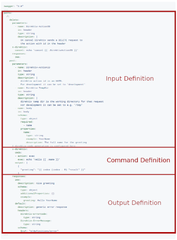

 # Direktiv Service Builder

Creating a new service takes three steps: configuring the input, the command, and output. This documentation will go through these three stages in detail, as well as all configuration choices. As a good technical individual, you may believe it's easier to just skip the documentation and go straight to the [examples](examples/README.md) as soon as possible. :wink:

- [Initializing the Service](#initializing-the-service)
- [Configuring the Input](#configuring-the-input)
- [Configuring the Commands](#configuring-the-input)
    - [Adding Commands](#adding-commands)
    - [Adding Foreach](#adding-foreach)
    - [Adding HTTP Requests](#adding-http-requests)
    - [Adding HTTP Foreach](#adding-http-foreach)
- [Configuring the Output](#configuring-the-output)
- [Compiling the Service](#compiling-the-service)
- [Advanced Features](#advanced-features) 
    - Delete method
    - pass through parameters
    - using output from former command
- [Custom Go Code](#custom-go-code)

## Initializing the Service

The first step starting with a new service is initializing the project. Direktiv's service builder comes with a docker container so no local installation is required. To initializ a project simply call the following command:

```
docker run -v `pwd`:/tmp/app direktiv/service-builder init myservice
```

> **TIP**: On Linux the owner of the created files is `root`. To avoid this pass in a user and group.

*Passing user and group id to the container*

```
docker run --user 1000:1000 -v `pwd`:/tmp/app direktiv/service-builder init myservice
```

The container maps a local directory to the container and uses it as the base. In the above example, we used the Linux `pwd` command, but this can also be a static file path. The service name is the last argument. There will be a new folder named v1.0.0 in the designated target folder after launching the container, which contains four files.

**1. Dockerfile**

A multi-stage build is used in the default Dockerfile. The generated application is built in the first stage. The second stage may be customized to meet the requirements of the service, for example through adding additional files to the base image or change the base image via the `FROM` directive. The last three lines should not be altered.

```docker
FROM golang:1.18-buster as build

COPY go.mod src/go.mod
COPY go.sum src/go.sum
RUN cd src/ && go mod download

COPY cmd src/cmd/
COPY models src/models/
COPY restapi src/restapi/

RUN cd src && \
    export CGO_LDFLAGS="-static -w -s" && \
    go build -tags osusergo,netgo -o /application cmd/myservice-server/main.go; 

FROM ubuntu:21.04

RUN apt-get update && apt-get install ca-certificates -y

# DONT CHANGE AFTER THIS 
COPY --from=build /application /bin/application

EXPOSE 8080

CMD ["/bin/application", "--port=8080", "--host=0.0.0.0"]
```

**2. swagger.yaml**

This file is the configuration file for the service and the configuration options will be explained in this documentation.

<p>

</p>

**3. run.sh**

This helper script builds the service and container and starts it. This script can be used for faster development and testing. Can be used after the service has been compiled the first time. 

**4. go.mod**

Manages the go dependencies. Should not be altered. 

## Configuring the Input

Configuring the input 

*Input Definition*
```yaml

```

*Direktiv Usage*
```yaml

```

Service Payload
```json

```


